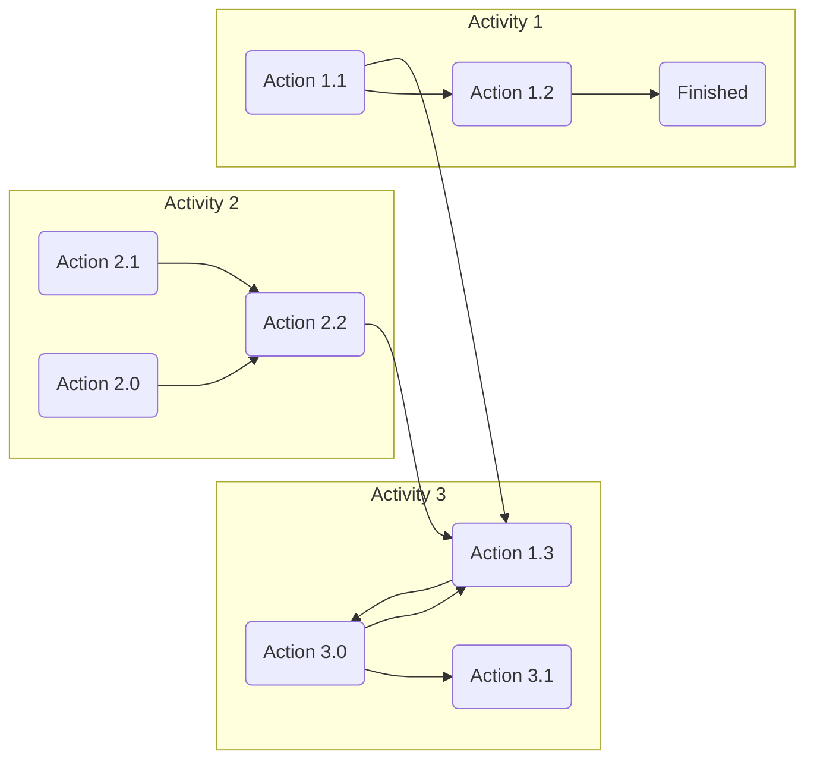

# Examples of Information Types: 

When compiling information, there are specific examples of information types that a designer can follow, for instance:

## Site Mapping:

Refers to the process of creating a visual representation of a website’s structure, layout, and content.

 Tap **+** to explore the interactive map of this site  



## Inventory/Audit:

Refers to the process of examining and cataloguing a set of items or resources, usually to determine their value or quantity.

| Variable | Value | Description |
|---|---|---|
|A |123| This is an item|
|B |456| This is also an item|
|C |789| This was an item| 

## Diagram:

Refers to a visual representation of a system, process, or structure, usually using symbols or diagram to represent different components.

## Tree Structure:

Refers to a hierarchical structure, usually represented as a tree, with nodes and branches that represent different elements or categories.

For example, a treeview of this website:

