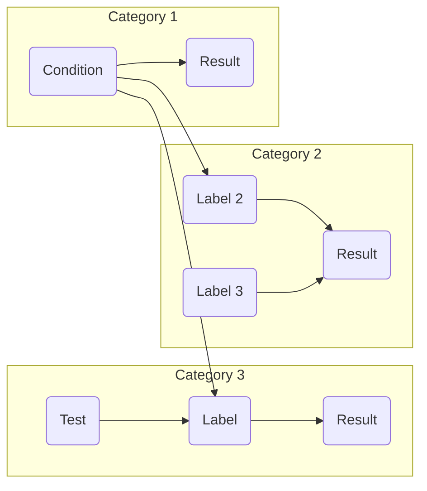

# Card Sorting
Card sorting is a user-centred design method for evaluation that involves organizing content into categories based on user feedback. This method is used to create an information architecture that is intuitive and easy to navigate. Measuring usability with card sorting involves testing how well users are able to understand and navigate the product and identifying areas where improvements can be made.

For example, during the development of a healthcare portal, users are asked to sort a list of medical conditions into categories that make sense to them. The categories that emerge from this exercise are used to inform the organization and labelling of the site's navigation structure.

The metric being measured is: the number of participants who are able to create the same or similar categories, indicating a consistent mental model of the proposed information architecture.

This metric relates to measuring usability and evaluating the information architecture by: testing the intuitiveness of the site's placement and labelling of medical conditions.
